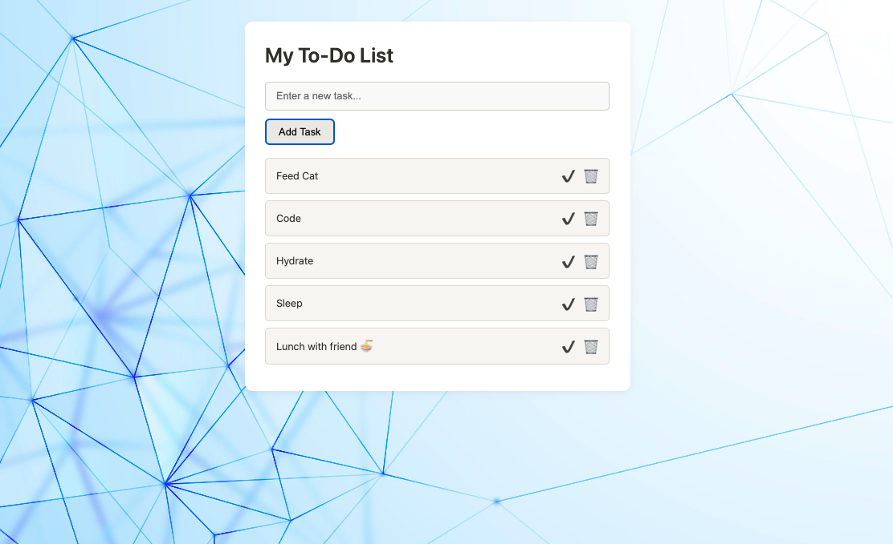

# Exercise: "To-Do List with Local Storage"

## GOAL

Create a simple to-do list where:

- ✅ A user can add tasks  
- 🔁 Tasks persist even after refreshing the browser using **localStorage**  
- 🗑 Tasks can be **marked as completed** or **deleted**

---

## You’ll Learn

- 📦 How to **read/write JSON** from `localStorage`  
- 🧩 Basic **DOM manipulation** and **event handling**  
- 💾 Persisting user input between sessions with client-side storage  

---

If you like this project, give it a ⭐  
**Follow** for more beginner-friendly exercises!  
Thank you and feel free to **contribute**.

---

